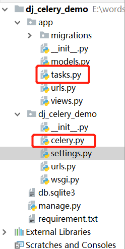

# celery使用指南--入门基础

>Auth: 王海飞
>
>Data：2019-03-29
>
>Email：779598160@qq.com
>
>github：https://github.com/coco369/knowledge

***

### 前言

Celery 是一个简单、灵活且可靠的，处理大量消息的分布式系统，并且提供维护这样一个系统的必需工具。

它是一个专注于实时处理的任务队列，同时也支持任务调度。

### 1. 何为消息队列？

任务队列是一种在线程或机器间分发任务的机制。

消息队列的输入是工作的一个单元，称为任务，独立的职程（Worker）进程持续监视队列中是否有需要处理的新任务。

Celery 用消息通信，通常使用中间人（Broker）在客户端和职程间斡旋。这个过程从客户端向队列添加消息开始，之后中间人把消息派送给职程。

Celery 系统可包含多个职程和中间人，以此获得高可用性和横向扩展能力。

<b>使用场景</b>

1. 异步任务

将耗时的操作任务提交给 Celery 去异步执行，比如发送短信/邮件、消息推送、音视频处理等等

2. 定时任务

类似于 crontab ，比如每日数据统计

### 2. celery组件

Celery 扮演生产者和消费者的角色,

<b>Celery Beat </b>: 任务调度器. Beat 进程会读取配置文件的内容, 周期性的将配置中到期需要执行的任务发送给任务队列.

<b>Celery Worker </b>: 执行任务的消费者, 通常会在多台服务器运行多个消费者, 提高运行效率.

<b>Broker </b>: 消息代理, 队列本身. 也称为消息中间件. 接受任务生产者发送过来的任务消息, 存进队列再按序分发给任务消费方(通常是消息队列或者数据库).

<b>Producer </b>: 任务生产者. 调用 Celery API , 函数或者装饰器, 而产生任务并交给任务队列处理的都是任务生产者.

<b>Result Backend </b>: 任务处理完成之后保存状态信息和结果, 以供查询.

结构图:

### 3. 消息代理

生产环境的消息代理有 RabbitMQ 和 Redis, 官方推荐 RabbitMQ.

### 4. 安装

安装celery相关库:

	pip install celery==3.1.5
	pip install django-celery==3.2.2
	pip install redis==2.10.6

如果安装最新django-celery3.2版本，则需要celery4版本小于4.0大于3。0的版本，且redis的版本必须小于3.0，因此各依赖库的版本号如上定义。

### 5. 配置

项目结构图如下:

