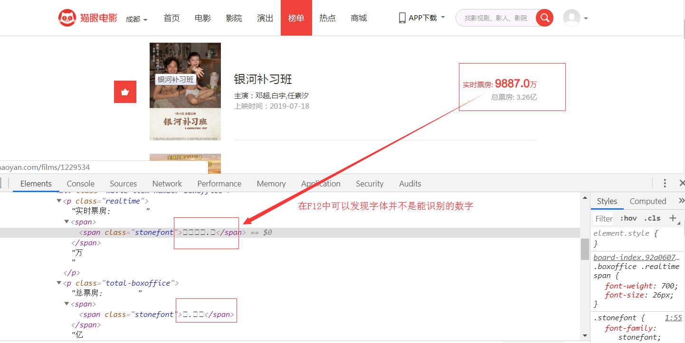
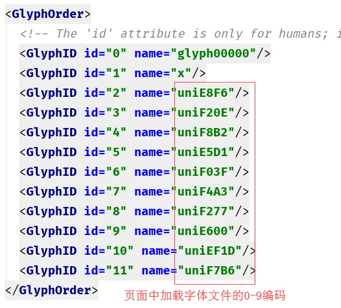

# 爬虫学习使用指南--字体加密破解

> Auth: 王海飞
>
> Data：2019-07-20
>
> Email：779598160@qq.com
>
> github：https://github.com/coco369/knowledge 

### 前言 -- 字体加密

​	字体反爬也就是自定义字体反爬，通过调用自定义的字体文件来渲染网页中的文字，而网页中的文字不再是文字，而是相应的字体编码，通过复制或者简单的采集是无法采集到编码后的文字内容的。 因此本案例将实现字体加密破解。目前许多网站都有字体加密策略，如58同城、猫眼电影等网站。

### 1. 字体文件

#### 1.1 猫眼网站分析

本实战以猫眼电影的票房为例。在猫眼的榜单中可以看到电影的实时票房。



通过查看网站的源码，可以发现票房的数字，并不是9887.0，而是如下图所示内容:


分析:  CSS 中有一个 @font-face，它允许网页开发者为其网页指定在线字体。原本是用来消除对用户电脑字体的依赖，现在有了新作用——反爬。

汉字光常用字就有好几千，如果全部放到自定义的字体中，那么字体文件就会变得很大，必然影响网页的加载速度，因此一般网站会选取关键内容加以保护，如上图所示，网站将实时票房的关键信息进行编码，导致爬虫在获取网站源码的时候，并不能直接提取出关键的票房等信息。

#### 1.2 字体文件分析

分析源码，从源码中找到@font-face属性，如下图所示:


将上图中以.woff结尾的地址输入到浏览器中，即可将该文件下载下下来。下载文件后，再使用百度字体编辑器FontEditor打开刚下载的字体文件(百度字体编辑器地址为: <http://fontstore.baidu.com/static/editor/index.html> )，如下图所示:


分析:  网页源码中显示的 &#xf403; 跟这里打开的字体文件显示的是不是有点像？事实上确实如此，去掉开头的 &#x 和结尾的 ; 后，剩余的4个16进制显示的数字加上 uni 就是字体文件中的编码。所以 &#xf403 对应的就是数字“5”。 

### 2. 代码实现 

#### 2.1 字体文件处理 

处理字体文件，我们需要用到 FontTools 库，安装如下:

```
pip install fonttools
```
然后，先将字体文件转换为 xml 文件，代码如下: 

```
from fontTools.ttLib import TTFont

# 打开和当前py文件同级的base2.woff 
font=TTFont('base2.woff')
# 将font字体文件保存为font2.xml格式文件
font.saveXML('font2.xml')
```

#### 2.2 xml文件解析 

​	打开xml文件，可以发现如下图所示内容，其中name参数显示的为0-9数字的编码，而id 仅仅是编号而已，千万别当成是对应的真实值。实际上，整个字体文件中，没有任何地方是说明 编码uniE8F6 对应的真实值是啥的。 




